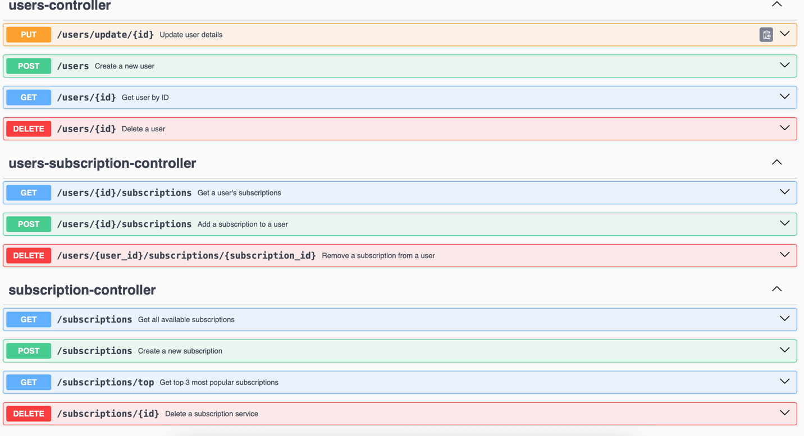

📦 Subscription Service

A simple microservice for managing users and their subscriptions (e.g., Netflix, Yandex, etc.), built with Spring Boot and PostgreSQL, and documented via Swagger.

---

🚀 Getting Started

Follow the steps below to launch the project locally using Docker.

1. 📄 Create Environment File

Copy the .env.example to .env and fill in the required environment variables:

```cp .env.example .env```

Make sure to specify the values such as database name, user, password and port.

---

2. 🐳 Run Docker Compose

Build and start the containers:

```docker-compose up --build```

This will start both the backend service and the PostgreSQL database.

---

3. 📖 Open Swagger UI

Once the services are up, access the API documentation at:

http://localhost:8080/swagger-ui/index.html#/

Here you can test all available endpoints, including user and subscription management.

---

🗒️ Default Subscriptions

Upon startup, the application automatically populates the database with a set of predefined subscription services:
•	Yandex Plus
•	YouTube Premium
•	Netflix
•	VK Music

These are immediately available for assignment to users.



🧹 Changing Environment Variables?

If you change any environment variables (such as DB credentials or ports), and you’re using Docker volumes, you may need to remove the old PostgreSQL volume.


📬 Contact

Telegram: @MKolar